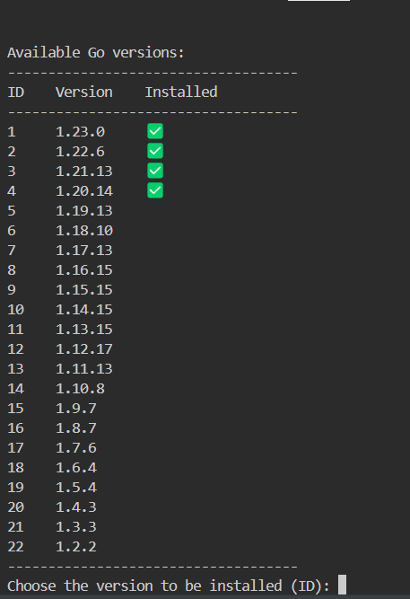

# go-installer

This is an open-source project aimed at simplifying the management of Go versions.

## Motivation

Instead of manually accessing the website or using the terminal to download a new version, extract its contents, and then move it to the directory specified in our environment variable, why not automate the entire process? 😉  
**Note:** Currently, this program is available only for Linux with the amd64 architecture.

## Future Steps and Improvements

As this is an open-source project, our first step is to validate its usefulness within the community. If it proves valuable, we can then enhance the initial code (which was primarily created to validate the idea) and, most importantly, extend the project to other operating systems.

## Execution

To run this program, you first need to download 'goinstaller', then execute the command `./bin/goinstaller`. The program will then present the following options:
    
If a version has already been downloaded on the user's machine, it will be indicated with a '✅'. We keep downloaded versions in a cache located in a dedicated directory, so there's no need to repeatedly download from the internet. In our case, there are 4 versions cached on the machine.  
**Note:** When switching versions, you must open a new terminal for the change to take effect. This is an area that could be improved.